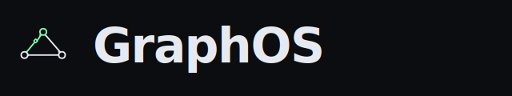
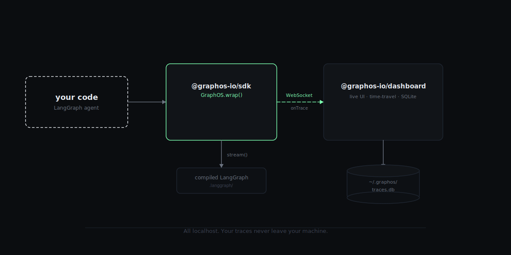

<p align="center">
  
</p>

<p align="center"><strong>The Service Mesh for AI Agents.</strong></p>

<p align="center">
  <a href="https://www.npmjs.com/package/@graphos-io/sdk"></a>
  <a href="https://www.npmjs.com/package/@graphos-io/sdk"></a>
  <a href="https://opensource.org/licenses/MIT"></a>
  <a href="https://nodejs.org/">= 20" /></a>
</p>

**GraphOS** is an open-source governance and observability layer for [LangGraph.js](https://langchain-ai.github.io/langgraphjs/).

Wrap your compiled graph in one line, get policy enforcement (loops, budgets) and a local-first live dashboard with time-travel replay. No SaaS, no signup, no telemetry leaving your machine.

<p align="center">
  <video src="https://raw.githubusercontent.com/ahmedbutt2015/graphos/main/assets/hero.mp4" autoplay loop muted playsinline width="900" poster="https://raw.githubusercontent.com/ahmedbutt2015/graphos/main/assets/architecture.svg">
    <a href="./assets/hero.mp4">▶ Watch the demo — GraphOS catches a runaway agent loop (12s)</a>
  </video>
</p>

---

## 🧐 Why GraphOS?

As agents move from demos to production, three things bite:

- **Infinite loops** — the agent ping-pongs between nodes, burning tokens silently.
- **Runaway cost** — one bad prompt eats your monthly OpenAI budget before you notice.
- **The black-box problem** — no way to see what happened inside a 20-step run until it's finished.

GraphOS fixes this by wrapping your `CompiledGraph` with a policy-driven interceptor and streaming every step to a local dashboard.

---

## ✨ What you get

### Policy enforcement
- **`LoopGuard`** — halt when a node revisits with identical state (`mode: "state"`) or simply visits N times (`mode: "node"`, for agents whose state grows on every iteration).
- **`BudgetGuard`** — kill the run when cumulative cost exceeds your USD ceiling.
- **`tokenCost()`** — drop-in cost extractor that reads `usage_metadata` off LangChain messages and applies a built-in price table for OpenAI + Anthropic models.

### Local dashboard
- **Live graph** — nodes glow as the agent traverses; halted nodes flash red.
- **Per-step detail panel** — click a step or scrub the timeline to see messages, tool calls, token usage, and the policy halt reason.
- **Session switcher + time-travel** — every run persists to SQLite (`~/.graphos/traces.db`); replay any past session step-by-step.

---

## 🛠 Install

```bash
npm install @graphos-io/sdk
# or
pnpm add @graphos-io/sdk
```

---

## 🚀 Quick start

```typescript
import {
  GraphOS,
  LoopGuard,
  BudgetGuard,
  tokenCost,
  createWebSocketTransport,
  PolicyViolationError,
} from "@graphos-io/sdk";
import { myLangGraphApp } from "./agent";

const managed = GraphOS.wrap(myLangGraphApp, {
  projectId: "my-agent",
  policies: [
    new LoopGuard({ mode: "node", maxRepeats: 10 }),
    new BudgetGuard({ usdLimit: 2.0, cost: tokenCost() }),
  ],
  onTrace: createWebSocketTransport(),
});

try {
  const result = await managed.invoke({
    messages: [{ role: "user", content: "Analyze the market." }],
  });
  console.log(result);
} catch (err) {
  if (err instanceof PolicyViolationError) {
    console.log(`halted by ${err.policy}: ${err.reason}`);
  } else {
    throw err;
  }
}
```

`invoke()` returns the merged final state. `stream()` is also available if you want to consume per-step updates yourself.

---

## 🖥 Run the dashboard

```bash
npx @graphos-io/dashboard graphos dashboard
```

Open [http://localhost:4000](http://localhost:4000). Run anything that calls `createWebSocketTransport()` and watch the graph execute live.

The dashboard persists every event to `~/.graphos/traces.db`. By default it keeps the 200 most-recent sessions and prunes older ones; tune via `GRAPHOS_RETENTION_SESSIONS`.

---

## 📦 Packages

| Package | What it does |
|---|---|
| [`@graphos-io/core`](./packages/core) | Shared types (`Policy`, `NodeExecution`, `TraceEvent`) |
| [`@graphos-io/sdk`](./packages/sdk) | `GraphOS.wrap()`, `LoopGuard`, `BudgetGuard`, `tokenCost`, transports |
| [`@graphos-io/dashboard`](./packages/dashboard) | Next.js + React Flow dashboard with `graphos` CLI |

---

## 🏗 Architecture

<p align="center">
  
</p>

The SDK runs in your process — zero network calls unless you point a transport at one. The dashboard is a separate local process started with `graphos dashboard`.

---

## 🧪 Run the demos from the monorepo

```bash
pnpm install
pnpm dev                # dashboard + WS telemetry
pnpm demo:loop          # LoopGuard halts an A↔B cycle
pnpm demo:budget        # BudgetGuard halts a 4-node pipeline
```

Open [http://localhost:4000](http://localhost:4000).

---

## 🗺 Roadmap

- [x] LoopGuard (state + node modes)
- [x] BudgetGuard + `tokenCost()` price-table cost extractor
- [x] WebSocket telemetry transport
- [x] Live graph view with active / halted node states
- [x] SQLite persistence + retention
- [x] Session switcher + time-travel scrubber
- [x] Per-step detail panel (messages, tool calls, usage)
- [x] `graphos dashboard` CLI
- [ ] MCPGuard + MCP proxy
- [ ] Python SDK parity

---

## 🤝 Contributing

Bug reports and PRs welcome at [github.com/ahmedbutt2015/graphos](https://github.com/ahmedbutt2015/graphos/issues).

## License

MIT — © Ahmed Butt
